# LeetCode刷塔攻略

## 1. 数组

### 1.1 数组遍历

#### 1.1.1 485 最多1的和

思路：遍历，有一就加Cnt，遇非1夹断，与当前最大maxCnt相比，大了替换小了不管！

```c++
int findMaxConsecutiveOnes(vector<int>& nums) {
     int Cnt = 0,maxCnt = 0;
    for(vector<int>::iterator it=nums.begin();it!=nums.end();it++){
        if(*it==1){
            Cnt++;}
        else{
            if(Cnt>=maxCnt)maxCnt = Cnt;
            Cnt = 0;
        }
    }
    maxCnt = max(Cnt, maxCnt);
    return maxCnt;
    }
```

#### 1.1.2 495：提莫攻击

解题思路
直接将本体转化为一个有条件的暴力加和，所以导致时间用时较多。
思路如下：
当两个攻击间隔大于duration时，对第一次攻击的duration累加在总时长上；
当两个攻击间隔不大于duration时，第二次攻击会刷新第一次攻击的时间，可视为第一次攻击的时间的缩短。再进行加和；


代码

```c++
class Solution {
public:
    int findPoisonedDuration(vector<int>& timeSeries, int duration) {
        /*duration:中毒时长
    timeSeries：时间序列
     */
    if(timeSeries.size()==0)return 0;
    int time= duration;
    for(int x=1; x<timeSeries.size();x++){
        cout<<time<<endl;
        //在范围外挨了下一箭
        //cout<<timeSeries[x]-(timeSeries[x-1]+duration);
        if(timeSeries[x]-(timeSeries[x-1]+duration)>=0)time = time + duration;
        //在范围内挨了下一箭
        if(timeSeries[x]-(timeSeries[x-1]+duration)<0){
            time =time + ((timeSeries[x]-timeSeries[x-1]));
            //cout<<"ok";
            }
    }
    return time;
 }
};
```

#### 1.1.3 414 第三大的数

取三个数，分别存，一次遍历

但是如果转化为取第n个大的数: 初步考虑使用排序，最后遍历三个不同的

```C++
int thirdMax(vector<int>& nums) {
        // 最大的三个数字 max1,max2,max3, 其中max3就是结果
        long max1 = LONG_MIN;
        long max2 = LONG_MIN;
        long max3 = LONG_MIN;

        int n = nums.size();
        for (int i = 0; i < n; ++i)
        {
            // 考虑大于第三大的数字，而且和第一大第二大都不相同，忽略相同的情况
            if (nums[i] > max3 && nums[i] != max1 && nums[i] != max2)
            {
                if (nums[i] > max1)
                {
                    // 更新max1
                    max3 = max2;
                    max2 = max1;
                    max1 = nums[i];
                }
                else if (nums[i] > max2)
                {
                    // 更新max2
                    max3 = max2;
                    max2 = nums[i];
                }
                else max3 = nums[i];
            }
        }
        // 考虑不存在max3,则直接返回最大值
        return max3 == LONG_MIN ? max1 : max3;
}
```

#### 1.1.4 628 三个数的最大乘积


```c++
int maximumProduct(vector<int>& nums) {
  sort(nums.begin(), nums.begin()+nums.size());
  for(int x=0;x<nums.size();x++)cout<<nums[x]<<endl;
  if(nums[0]*nums[1]>=nums[nums.size()-2]*nums[nums.size()-3]&&(nums[nums.size()-1]>=0))return nums[0]*nums[1]*nums[nums.size()-1];
  else
  return (nums[nums.size()-1]*nums[nums.size()-2]*nums[nums.size()-3]);

}
```

### 1.2 数组元素

#### 1.2.1  错误的集合

```c++
vector<int> findErrorNums(vector<int>& nums) {

  int sum=0 , len =nums.size() , c_Sum=(1+len)*len/2 , loss, repeat;
  sort(nums.begin() , nums.end()); //将数组排序
  for(int i=0 ; i<len-1 ; i++){
    if(nums[i]==nums[i+1])
      repeat =nums[i];//找出重复的
  }
  for(int i=0 ; i<len ;i++){
    sum+=nums[i];
  }
  loss = repeat+(c_Sum-sum);
  return {repeat , loss};
}
```

#### 1.2.2 消失的数字

原地修改策略：如果数字x存在于数组中，则x对应的地址为nums[x],将对应位置的数字置为负数，完成之后遍历数组，如果对应地方为正数，则说明数组中此位置数字丢失。
这道题好做的原因还是数字介于1-n且都为正，这样就联系起来了数组下标和数组内容。

```c++
vector<int> findDisappearedNumbers(vector<int>& nums) {
        vector<int> res;
        for(int x=0; x<nums.size(); x++){
            if(nums[abs(nums[x])-1]>0){
                nums[abs(nums[x])-1] = -nums[abs(nums[x])-1];
            }
            else continue;
        }
        for(int x=1;x<=nums.size();x++){
            if(nums[x-1]>0){
                res.push_back(x);
            }
        }
        return res;
    }


```

#### 1.2.3 数组中重复数据

**解题思路**

D7：本解法由448拓展而来，建议和448结合食用，首先遍历一遍数组，由于数组中数据都是分布于1~n，所以我们第一次遍历时，遇到的数字都以他为下标进行重定向，比如对于没有重复的数组，x应该位于num[x-1]，那么我们可以利用这个位置对应关系来计数。每次遇到x就在nums[x-1]中加n+1,在遍历时取模。这样第二次遍历中，我们可以通过查看对应位置中有几个n+1来判断x出现了几次。

**代码**

```c++
class Solution {
public:
    vector<int> findDuplicates(vector<int>& nums) {
    int flag = nums.size()+1;
    vector<int> res;
    for(int x=0;x<nums.size();x++){
        nums[nums[x]%flag-1] += flag;
    }
    for(int x=0;x<nums.size();x++){
        if((nums[x]-2*flag)>0){
            res.push_back(x+1);
        }
    }
    return res;
}
};
```

#### 1.2.4 缺失的第一个正数

D8解题思路：排序，遍历，大于零的第一个如果是1，return 1，第一个不是一，往后找，返回第一个+1不等于随后一个数的数。
遍历到最后返回nums[nums.size()-1]+1。


```c++
int firstMissingPositive(vector<int>& nums) {
  sort(nums.begin(), nums.end());
  bool flag = false;
  for(int x = 0;x < nums.size();x++){
  if(nums[x]>0){
     if(nums[x]==1)flag=true;
     if(nums[x]!=1&&flag==false)return 1;
     if(x==nums.size()-1)return nums[x]+1;
     if(nums[x+1]!=nums[x]+1&&nums[x+1]!=nums[x])return nums[x]+1;
}
}
  if(nums[nums.size()-1]<=0)return 1;
}
```

新题解：类似于1.2.3，我们对数组进行遍历，对于遍历到的数 xx，如果它在 [1, N][1,N] 的范围内，那么就将数组中的第 x-1 个位置（注意：数组下标从 0 开始）打上「标记」。在遍历结束之后，如果所有的位置都被打上了标记，那么答案是 N+1，否则答案是最小的没有打上标记的位置加 1。

算法的流程如下：

1. 我们将数组中所有小于等于 00 的数修改为 N+1N+1；

2. 我们遍历数组中的每一个数 x，它可能已经被打了标记，因此原本对应的数为 |x|，其中∣∣ 为绝对值符号。如果 ∣x∣∈[1,N]，那么我们给数组中的第∣x∣−1 个位置的数添加一个负号。注意如果它已经有负号，不需要重复添加；

3. 在遍历完成之后，如果数组中的每一个数都是负数，那么答案是 N+1，否则答案是第一个正数的位置加 1。

```c++
int firstMissingPositive(vector<int>& nums) {
    int n = nums.size();
    for (int& num: nums) {
      if (num <= 0) {
        num = n + 1;
      }
    }
    for (int i = 0; i < n; ++i) {
     int num = abs(nums[i]);
      if (num <= n) {
        nums[num - 1] = -abs(nums[num - 1]);
      }
    }
    for (int i = 0; i < n; ++i) {
      if (nums[i] > 0) {
        return i + 1;
      }
   }
    return n + 1;
}
```

#### 1.2.5 H指数

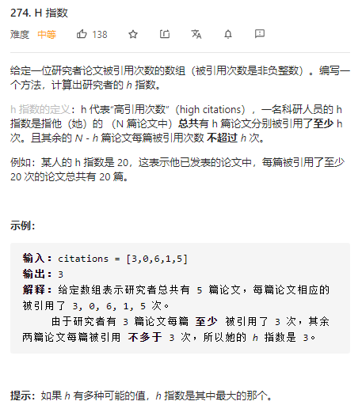

解题思路：

先排序，后序遍历，如果要有H指数，对应citation[size-x-1]位置上的引用数应该大于当前的引用。

```c++
class Solution {
public:
  int hIndex(vector<int>& citations) {
  sort(citations.begin(), citations.end());
  int h=0;
  for(int x=citations.size()-1; x>=0;x--){
  if(citations[citations.size()-1-x]>x) h++;
  }
  return h;
}
};
```

新思路：计数排序

算法的步骤如下：

- （1）找出待排序的数组中最大和最小的元素
- （2）统计数组中每个值为i的元素出现的次数，存入数组C的第i项
- （3）对所有的计数累加（从C中的第一个元素开始，每一项和前一项相加）
- （4）反向填充目标数组：将每个元素i放在新数组的第C(i)项，每放一个元素就将C(i)减去1


```java
public class Solution {
    public int hIndex(int[] citations) {
        int n = citations.length;
        int[] papers = new int[n + 1];
        // 计数
        for (int c: citations)
            papers[Math.min(n, c)]++;
        // 找出最大的 k
        int k = n;
        for (int s = papers[n]; k > s; s += papers[k])
            k--;
        return k;
    }
}
```

### 1.3 数组的改变，移动

#### 1.3.1 最小操作次数使数组元素相等

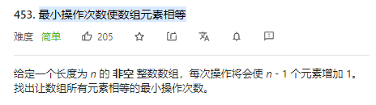

解题思路：

除一个数全增1等于这个数减1，遍历一遍找到最小值，计算每个值到最小值的距离的和

```c++
class Solution {
public:
    int minMoves(vector<int>& nums) {
    if(nums.size()==1)return 0;
    int minNum = nums[0];
    int sum=0;
    for(int &num: nums){
        minNum = min(minNum, num);
    }
    for(int x=0; x<nums.size(); x++){
        sum += nums[x]-minNum;
    }
    return sum;
}
};
```

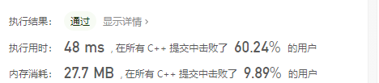

#### 1.3.2 非递减数列

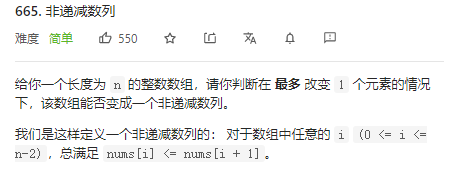

解题思路：贪心算法

算法步骤：

遍历数组，如果遇到递减：
还能修改：
修改方案1：将nums[i]缩小至nums[i + 1]；
修改方案2：将nums[i + 1]放大至nums[i]；
不能修改了：直接返回false；

本题唯一的易错点就在这，

如果将nums[i]缩小，可能会导致其无法融入前面已经遍历过的非递减子数列；
如果将nums[i + 1]放大，可能会导致其后续的继续出现递减；
所以要采取贪心的策略，在遍历时，每次需要看连续的三个元素，也就是瞻前顾后，遵循以下两个原则：

需要尽可能不放大nums[i + 1]，这样会让后续非递减更困难；
如果缩小nums[i]，但不破坏前面的子序列的非递减性；

```c++
 bool checkPossibility(vector<int>& nums) 
  {
    if (nums.size() == 1)  return true;
    bool flag = nums[0] <= nums[1] ? true : false; 
   for (int i = 1; i < nums.size() - 1; i++)
    {
      if (nums[i] > nums[i + 1]) 
      {
        if (flag)  
        {
          if (nums[i + 1] >= nums[ i - 1])
            nums[i] = nums[i + 1];
          else              
            nums[i + 1] = nums[i];   
          flag = false;         
        }  
        else    
          return false;
      }
    }
    return true;
 }
```

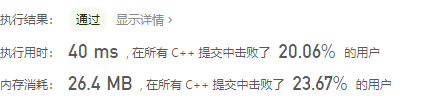

#### 1.3.3 移动零

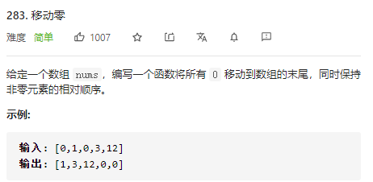

D10解题思路：

双循环，外层循环找到0，内层循环找到非零，互换：

```c++
void moveZeroes(vector<int>& nums) {
    for(int x=0; x<nums.size(); x++){
        if(nums[x]==0){
        for(int y=x;y<nums.size();y++){
            if(nums[y]!=0){swap(nums[x],nums[y]);
            break;
            }
        }
        }
    }
     for(int x=0; x<nums.size(); x++){
         cout<<nums[x]<<" ";
     }

}
```

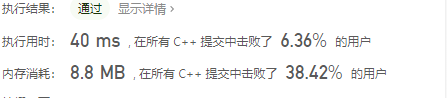

双指针：

```C++
int right=0;
    for(int left=0; left<nums.size(); left++){
        if(nums[left]){
            swap(nums[right],nums[left]);
            right++;
        }
    }
    for(int x=0; x<nums.size(); x++){
         cout<<nums[x]<<" ";
     }
```

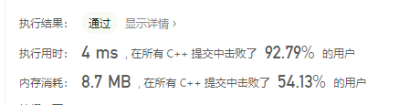

### 1.4 二维数组及滚动数组

#### 1.4.1 杨辉三角

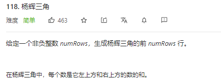

解题思路：

首尾默认加一，其他地方按题目要求即可，注意下标对应

```c++
vector<vector<int>> generate(int numRows) {
    vector<vector<int>> Triangle;
    vector<int> row;
    for(int x=1; x<=numRows; x++){
        for (int y=1; y<=x; y++){
            //首尾加1
            if(row.size()==0) {row.emplace_back(1);continue;}
            if(y==x||y==1){row.emplace_back(1);continue;}
            row.emplace_back(Triangle[x-2][y-1]+Triangle[x-2][y-2]);
        }
        Triangle.emplace_back(row);
        row.clear();
    }
    return Triangle;
}
```

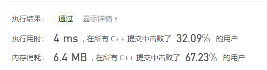

#### 1.4.2 杨辉三角II

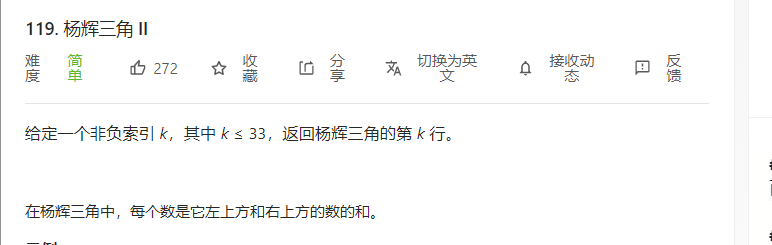

解题思路：两个vector，一个存上一行一个存下一行

```c++
vector<int> getRow(int rowIndex) {
     vector<int> row_1 = {1};
     vector<int> row_2 = {1,1};
     if(rowIndex == 0)return row_1;
     if(rowIndex == 1)return row_2;
     for(int x=1; x<=rowIndex; x++){
         row_1.swap(row_2);
         row_2.clear();
         for(int y=0; y<=x; y++){
            if(y==0 || y==x)row_2.emplace_back(1); 
            else
            row_2.emplace_back(row_1[y]+row_1[y-1]);  
         }
        
     }
     //for(int x=0;x<row_2.size();x++)cout<<row_2[x]<<" ";
     return row_2;
```


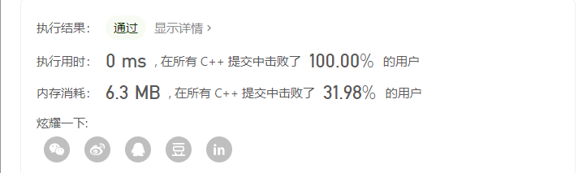

改进解法：只用一个数组

能否只用一个数组呢？

递推式 表明，当前行第 i项的计算只与上一行第 i-1 项及第 i 项有关。因此我们可以倒着计算当前行，这样计算到第 i 项时，第 i-1 项仍然是上一行的值。

```c++
class Solution {
public:
    vector<int> getRow(int rowIndex) {
        vector<int> row(rowIndex + 1);
        row[0] = 1;
        for (int i = 1; i <= rowIndex; ++i) {
            for (int j = i; j > 0; --j) {
                row[j] += row[j - 1];
            }
        }
        return row;
    }
};
```

#### 1.4.3 范围求和II

D11：

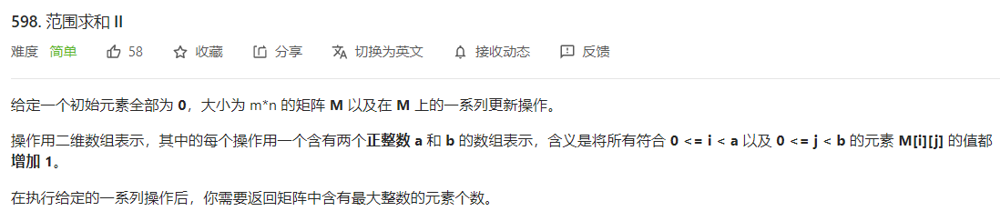

解题思路：

两维的最小值处的值保证了每次都能加1

```c++
int maxCount(int m, int n, vector<vector<int>>& ops) {
    if(ops.size()==0)return m*n;
    int min_a = m, min_b = n;
    for(int x=0; x<ops.size(); x++){
        min_a = min(min_a, ops[x][0]);
        min_b = min(min_b, ops[x][1]);
    }
    return min_a*min_b;
}
```


### 1.5 数组的旋转

#### 1.5.1 旋转数组

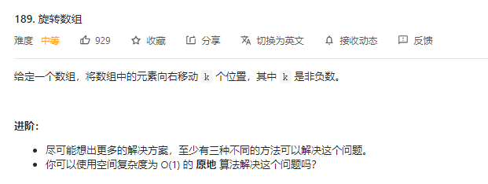

D12:

解题思路1：

使用一个新数组接收旋转的数组

```c++
void rotate(vector<int>& nums, int k) {
    vector<int> newNum(nums.size());
    for(int n=0; n<nums.size(); n++){
        if(n+k >= nums.size()){
            newNum[(n+k)%nums.size()]=nums[n];
        }
        else newNum[n+k] = nums[n];
    }
    newNum.swap(nums);
}
```


解题思路2：

方法一中使用额外数组的原因在于如果我们直接将每个数字放至它最后的位置，这样被放置位置的元素会被覆盖从而丢失。因此，从另一个角度，我们可以将被替换的元素保存在变量 中，从而避免了额外数组的开销。


```c++
   void rotate(vector<int>& nums, int k) {
    int n = nums.size();
    k = k % n;
    int count = __gcd(k, n);
    for (int start = 0; start < count; ++start) {
        int current = start;
        int prev = nums[start];
        do {
            int next = (current + k) % n;
            swap(nums[next], prev);
            current = next;
        } while (start != current);
    }
}
```


#### 1.5.2 旋转函数

D13：

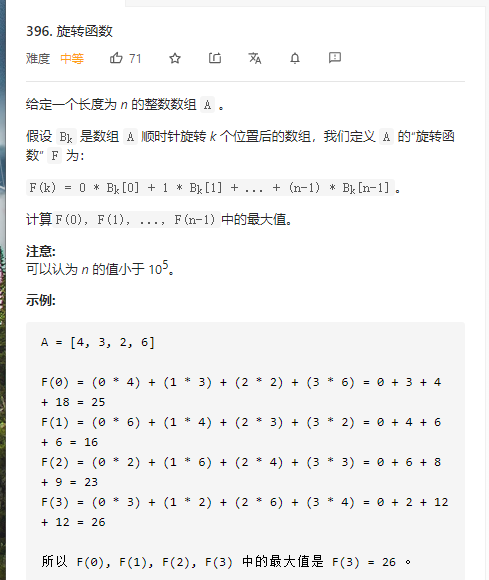

解题思路1：

旋转数组，分别求大小

解题思路2：

所有数组全体右移，相当于每一位全加1，并减去n*sums[n-1]

```c++
int maxRotateFunction(vector<int>& nums) {
    int res = 0;
    int max_res = INT_MIN;
    int sum_num = 0;
    for(int x = 0; x<nums.size(); x++){
        sum_num += nums[x];
        res += x*nums[x];
    }
    for(int x = nums.size()-1; x >= 0; x--){
        res = res + sum_num - nums[x]*nums.size();
        max_res = max(max_res, res);
    }
    return max_res;
}
```


### 1.6 特定顺序遍历二维数组

#### 1.6.1 螺旋矩阵

D14：

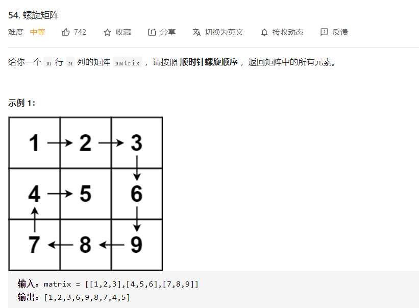

解题思路：绕圈圈，由最外层转一圈，进内层再开始转一圈转到无处可转。

```c++
vector<int> spiralOrder(vector<vector<int>>& matrix) {
     if(matrix.size()==0&&matrix[0].size()==0)return {};
     vector <int> res;
     int left=0;int top=0;int buttom = matrix.size()-1;int right = matrix[0].size()-1;
     while(left <= right && top <= buttom){
         for(int column=left; column <= right; column++)
         res.push_back(matrix[top][column]);
         for(int row = top+1; row<=buttom; row++)
         res.push_back(matrix[row][right]);
         if(left<right && top<buttom){
             for(int column = right-1; column>=left; column--)
             res.push_back(matrix[buttom][column]);
             for(int row = buttom-1; row> top; row--)
             res.push_back(matrix[row][left]);
         }
         top++;
         left++;
         buttom--;
         right--;
     }
     return res;
}
```


#### 1.6.2 螺旋矩阵II

d14：

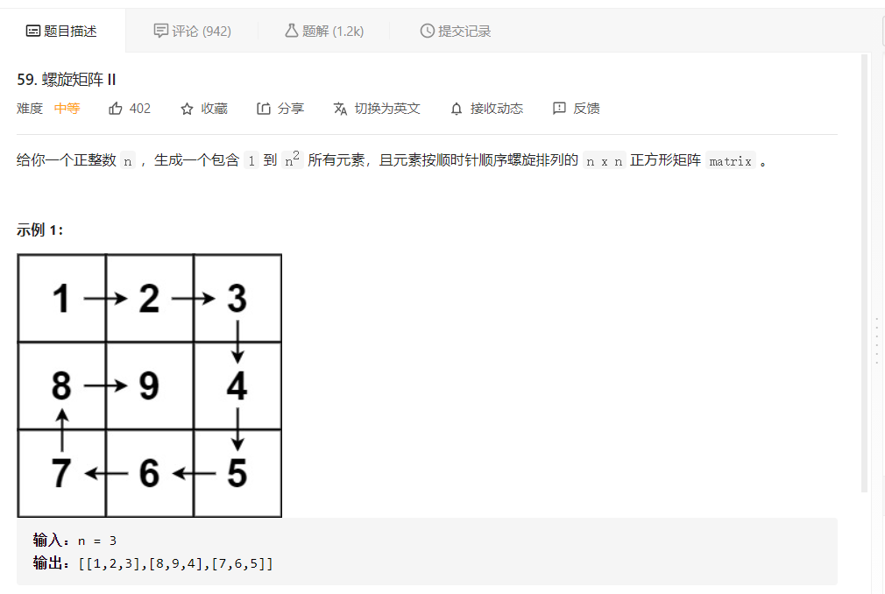

解题思路：

和I相同，按层遍历

```c++
vector<vector<int>> generateMatrix(int n) {
    vector<vector <int>> list(n, vector<int>(n));

    int left=0;int top=0;int buttom = n-1;int right = n-1;
    int num= 1;
    while(left <= right && top <= buttom){
        for(int column = left; column <= right; column++){
            list[top][column] = num;
            num++;
        }
        for(int row = top+1; row<=buttom; row++){
            list[row][right] = num;
            num++;
        }
        if(left<right && top<buttom){
            for(int column = right-1; column >= left; column--){
                list[buttom][column] = num;
                num++;
            }
            for(int row = buttom -1; row > top; row--){
                list[row][left] = num;
                num++;
            }
        }
        top++;
         left++;
         buttom--;
         right--;
    }
    return list;
}
```


#### 1.6.3 对角线遍历

D15：

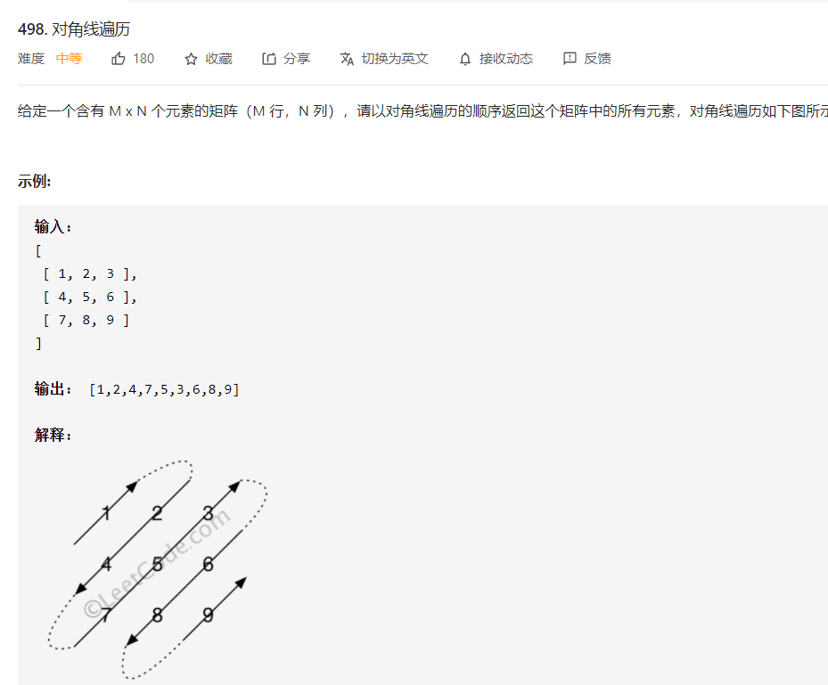

解题思路：

**1.** 共两种方向的对角线，根据（col+row-1）%2确定是向右上或者左下

**2.** 向左上遍历到头，再分两种情况

**3.** 如果再走一步，col未越界，则m++回来就行

**4.** 如果col也越界，则意味着走到了二维矩阵的下三角， m = m+2;n--;

**5.** 右下同样

```c++
vector<int> findDiagonalOrder(vector<vector<int>>& matrix) {
    vector<int> list;
	int row = matrix.size();
	if (row == 0) return list;
	int col = matrix[0].size();
	if (col == 0) return list;
    int num = col + row -1;
    int m=0, n=0;
    for(int i=0; i<num; i++){//计数，一旦有这么多就跳出
        if(i % 2 == 0){//往右上
        while(m >=0 && n < col){//不越界
            list.push_back(matrix[m][n]);
            m--;
            n++;
        }
        if(n < col){
            m++;
        }else{//对角线越界
            m = m+2;
            n--;
        }
        }
        else{
            while(n>=0 && m<row){
                list.push_back(matrix[m][n]);
                m++;
                n--;
            }
            if(m < row )n++;
            else{
                n = n+2;
                m--;
            }
        }
    }
    return list;
}
```


### 1.7 二维数组变换

#### 1.7.1 重塑矩阵

D16：

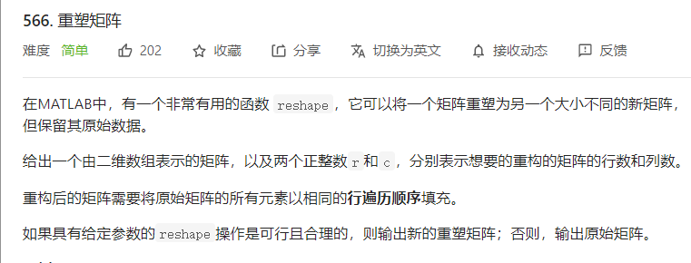

解题思路：

**1.** 遍历nums

**2.** 挨个放入list

**3.** list的下标改变

```c++
vector<vector<int>> matrixReshape(vector<vector<int>>& nums, int r, int c) {
    vector<vector<int>> list(r,vector<int>(c));
    int n_row = nums.size();
	int n_col = nums[0].size();
    if(n_col*n_row!=r*c)return nums;
    int m=0,n=0;
    for(int x=0;x<n_row;x++){
        for(int y=0;y<n_col;y++){
            list[m][n]=nums[x][y];
            n++;
            if(n==c){
                n=0;
                m++;
            }
        }
    }
    return list;
}
```


1.7.2 旋转矩阵

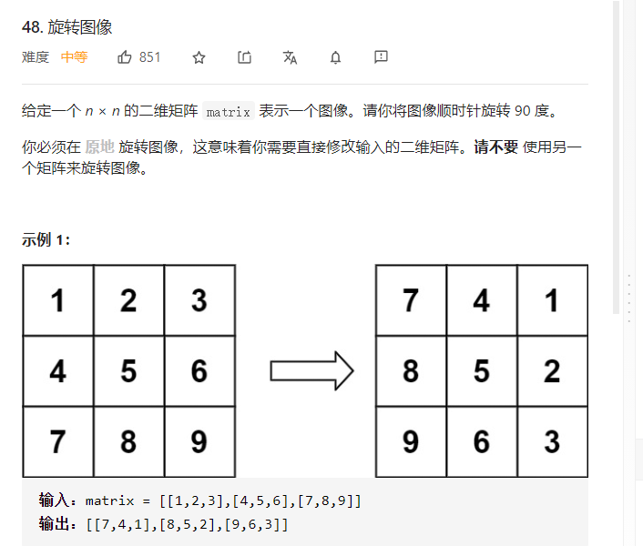

思路：

1. 上下对半旋转
2. 主对角线旋转

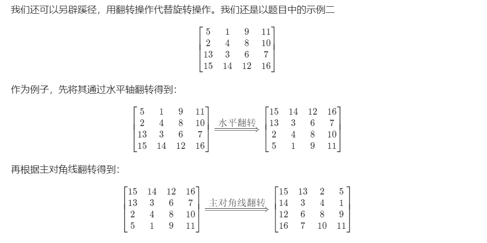

```c++
void rotate(vector<vector<int>>& matrix) {
    void rotate(vector<vector<int>>& matrix) {
        int n = matrix.size();
        // 水平翻转
        for (int i = 0; i < n / 2; ++i) {
            for (int j = 0; j < n; ++j) {
                swap(matrix[i][j], matrix[n - i - 1][j]);
            }
        }
        // 主对角线翻转
        for (int i = 0; i < n; ++i) {
            for (int j = 0; j < i; ++j) {
                swap(matrix[i][j], matrix[j][i]);
            }
        }
    }
}
```


#### 1.7.2 矩阵置零

D17：

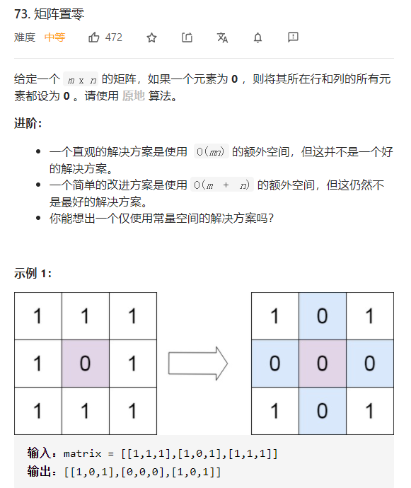

解题思路;

**1.** 设定两个flag，Xneedclr。Yneedclr,用于记录第0行和第0列是否需要清除

**2.** 开始逐行遍历

**3.** 一旦遇到有0，将此列的第一个数置为0，在整行遍历完后，让此行第一个数置为0，这样所有的置零位数都是已经读过的数

**4.** 遍历完成后，查首行的0和首列的0，查到了就置这一行或一列为0

**5.** 根据两个flag确定是否要清除第0行/列

```c++
void setZeroes(vector<vector<int>>& matrix) {
    int row = matrix.size();
    int col = matrix[0].size();
    int flag = 1;
    int Xneedclr=0;
    int Yneedclr=0;
    for(int i = 0; i < row; i++){
        flag=1;
        for(int j = 0; j < col; j++){
            if(matrix[i][j]==0){
                if(i==0)Xneedclr=1;
                if(j==0)Yneedclr=1;
                matrix[0][j] = 0;//置列头为0
                flag = 0;//当前行需要清零
            }

        }
        //当前行搜索完成
        if(flag == 0)
        matrix[i][0] = 0;//将已搜索过的行头置为零
    }
    
    for(int i = 0; i < row; i++){
        if(matrix[i][0]==0){//第零列不清零，会去除标志位
            if(i==0)continue;
        for(int j=1; j< col;j++){
            matrix[i][j]=0;
        }
    }
    }
    for(int j=0; j<col; j++){
        if(matrix[0][j]==0){
            if(j==0)continue;
            for(int i=0; i<row; i++){
                matrix[i][j]=0;
            }
        }
    }
     if(Xneedclr==1){
         for(int j=0; j<col; j++){
             matrix[0][j]=0;
         }
     }
     if(Yneedclr==1){
         for(int i=0; i<row; i++){
             matrix[i][0]=0;
         }
     }
        
}

```


#### 1.7.3 生命细胞

D18：

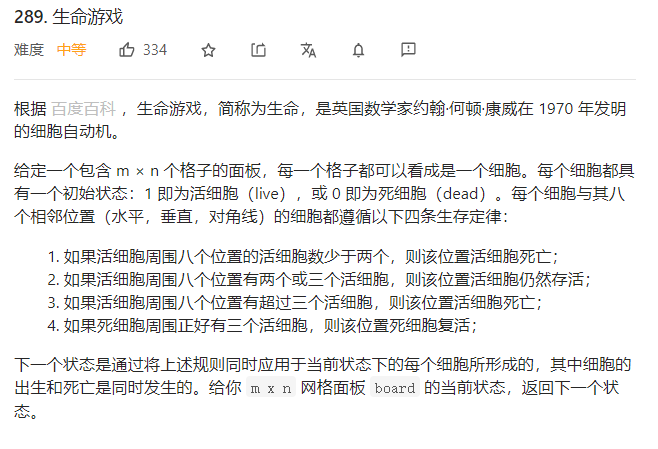

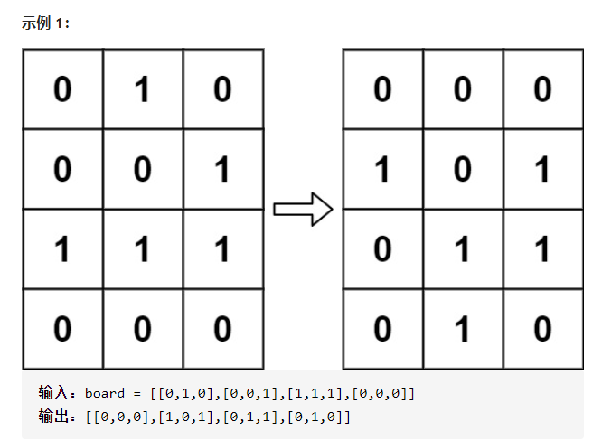

解题思路：

**1.** 遍历每个元素

**2.** 对周围八个求和，-1当做活细胞

**3.** 若原来是活细胞，死了，置为-1

**4.** 若原来是死细胞活了，置为2

**5.** 再次遍历，更新状态

```c++
void gameOfLife(vector<vector<int>>& board) {
    int row = board.size();
    int col = board[0].size();
    int move[3] = {1, 0, -1};

    for(int x = 0; x < row; x++){
        for(int y= 0; y < col ; y++){//两层循环每一个细胞，判死活并更新状态；

        int neiber = 0;

        for(int i=0; i<3; i++){
            for(int j=0; j<3; j++){

                int r = x + move[i];
                int c = y + move[j];
                if(move[i]==0&&move[j]==0)continue;
                if((r<row&&r>=0)&&(c<col&&c>=0)&&(board[r][c]==1||board[r][c]==-1))
                neiber++;
            }
        }
        if(board[x][y]==1){//活细胞
        if(neiber<2||neiber>3)board[x][y]=-1;//死
        }
        if(board[x][y]==0&&neiber==3)
            board[x][y]=2;
        }
    }

    for(int x = 0; x < row; x++){
        for(int y= 0; y<col ; y++){//两层循环每一个细胞，判死活并更新状态；
        if(board[x][y]==2)board[x][y]=1;
        if(board[x][y]==-1)board[x][y]=0;//更新状态
        }
    }
    }
```


### 1.8 前缀和数组

#### 1.8.1 除自身以外的数组

D19:

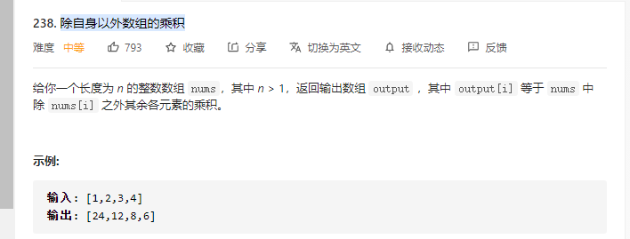

解题思路：

1. 先遍历一遍，将所有的左前缀放到数组里
2. 在倒序遍历一遍，用R记录右前缀，并可以与左前缀相乘放入原位置

```c++

vector<int> productExceptSelf(vector<int>& nums) {
    vector <int> res(nums.size());
    res[0] = 1;
    for(int n=1; n<nums.size(); n++){
        res[n] = res[n-1]*nums[n-1];
    }//将左边都存入

    int R = 1;
    for(int n=nums.size()-1; n>=0; n--){
        res[n] = res[n]*R;
        R *= nums[n];
    }
    return res;

}

```

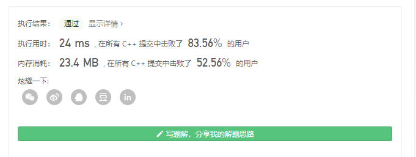

## 2. 字符串

### 2.1 字符

#### 2.1.1 检测大写字母

D20：

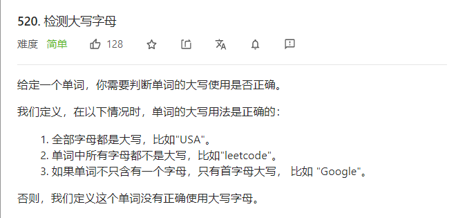

解题思路：

判断

```C++
bool detectCapitalUse(string word) {

    bool res = true;
    if(97<=word[0]&&word[0]<=122){
        for(int n=1; n<word.size(); n++){
            char q = word[n];
            if(97>word[n]||word[n]>122){}
            res=false;
            break;
        }
    }
    if(word[0]>=65&&word[0]<=90){
        if(word[1]>=65&&word[1]<=90){//全大写
            for(int n=2; n<word.size(); n++){
            if(65>word[n]||word[n]>90){
                res=false;
                break;
                }
            }
        }
        if(word[1]>=97&&word[1]<=122){//小写
            for(int n=2; n<word.size(); n++){
            if(word[n]<97||word[n]>122){
                res=false;
                break;
                }
            }
        }
    }
    return res;
}

```


### 2.2 回文数

#### 2.2.1 验证回文串

D21：

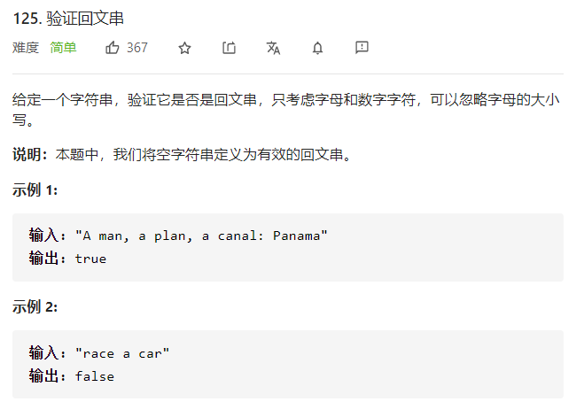

思路：双指针两边探遇到非字母数字字符跳过。

主要学习一下那几个API

```c++
 bool isPalindrome(string s) {
        int n = s.size();
        int left = 0, right = n - 1;
        while (left < right) {
            while (left < right && !isalnum(s[left])) {
                ++left;
            }
            while (left < right && !isalnum(s[right])) {
                --right;
            }
            if (left < right) {
                if (tolower(s[left]) != tolower(s[right])) {
                    return false;
                }
                ++left;
                --right;
            }
        }
        return true;
}
```


### 2.2公共前缀

#### 2.2.2 最长回文串

D22：

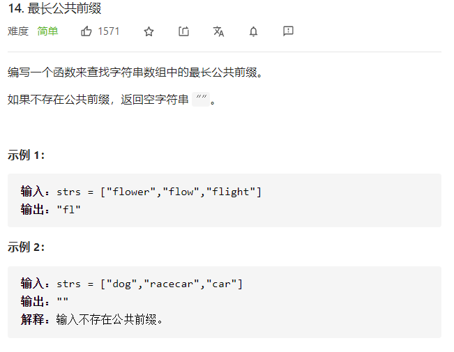

解题思路：

每一个string的首字母都与str[0]比较，接下来比第二个，一直比到不相同，返回；

```c++
 string longestCommonPrefix(vector<string>& strs) {
     if(strs.size()==0)return "";
     for(int x=0; x<strs[0].size(); x++){//由第一个字符开始
         for(int y=1; y< strs.size(); y++){
             if(strs[0][x]!=strs[y][x]||x == strs[y].size())
             return strs[0].substr(0, 0 + x);
         }
     }
     return strs[0];
}

```


### 2.3 单词

#### 2.3.1 字符串中的单词数

D23：

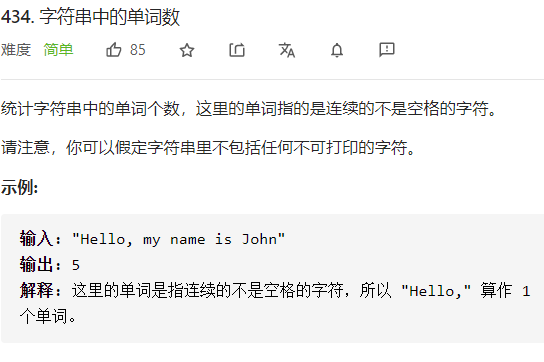

代码：

```c++
int countSegments(string s) {
    int num = 0;
    for(int x = 0; x < s.size() ; x++ ){
        if((num == 0 || s[x-1] == ' ')&&s[x]!=' ')num++;
    }
    return num;
}

```

```java
 public int countSegments(String s) {
    	int segmentCount = 0;
        for (int i = 0; i < s.length(); i++) {
            if ((i == 0 || s.charAt(i-1) == ' ') && s.charAt(i) != ' ') {
                segmentCount++;
            }
        }

        return segmentCount;
    }
```


#### 2.3.2 最后一个单词长度

D24：

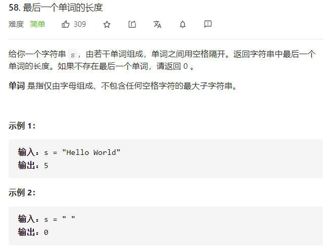

代码：

```c++
int lengthOfLastWord(string s) {
    int len = 0;
    for(int x = s.size()-1; x >= 0; x--){
        if(s[x]!=' '){//第一个不是‘ ’的字符
            len++;
            if(((x-1)<0)||s[x-1]==' ')return len;
        }
    }
    return len;
}
```


```java
public int lengthOfLastWord(String s) {
    	int len = 0;
    	s = s.trim();
    	for(int x = s.length()-1; x>=0; x--) {
    		len++;
    		if(x-1<0||s.charAt(x-1)==' ')break;
    	}
    	return len;
    }
```


### 2.4 翻转字符串

#### 2.4.1 翻转字符串II

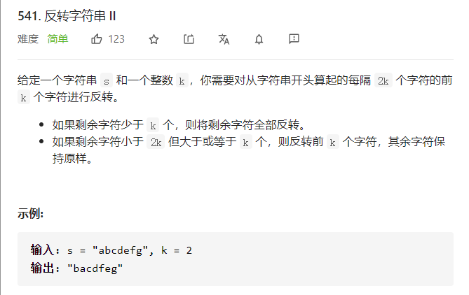

代码：

```c++
string reverseStr(string s, int k) {
        int i = 0,n=s.size();
        while (i < n) { // 指针没到字符串末尾进入循环
            if (i + k > n) { // 指针后面不够k个就全部反转
                reverse(s.begin()+i, s.end());
            } else {
                reverse(s.begin()+i, s.begin()+i+k);//reverse的第二个参数是指向要翻转范围的下一个
            }
            i += 2*k;
        }
        return s;
    }
```


#### 2.4.2 反转字符串中的单词III

D26:

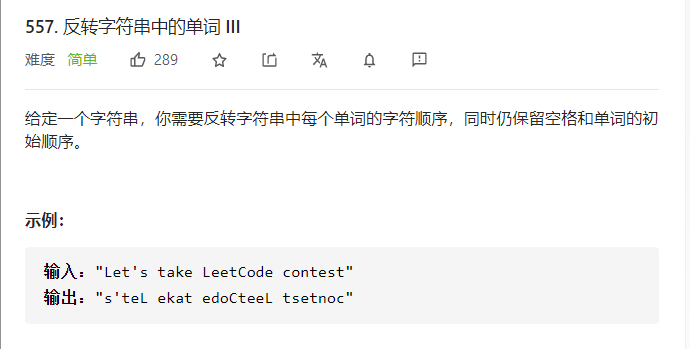

```c++
string reverseWords(string s) {
    int j=0;
    for(int i=0; i<s.size();i++){
        if(s[i]==' ')continue;
        if(s[i]!=' '){
            int j=0;
            while(s[i+j]!=' '&&(i+j)<s.size()){
                j++;
            }
           reverse(s.begin()+i, s.begin()+i+j);
            i=j+i;
        }
    }
    return s;
}

```


#### 2.4.3 翻转字符串里的单词*

D27: 


解题思路1：

1. 将s放入stringstream中
2. 由ss依次取出单个string加入到结果ans前面，并加上一个空格
3. 去除首空格

```c++
string reverseWords(string s) {
    stringstream str;
    string ans = "", temp;
    str<<s;
    while(str>>temp){
        ans = " "+temp+ans;
    }
    if(ans!=""){
        ans.erase(ans.begin());
    }
    return ans;
}
```

解题思路2：

1. 翻转全部字符串
2. 翻转单词
3. 去除多余空格

```c++
 string reverseWords(string s) {
    //1. 先翻转整个字符串
    //int i = 0, j = 0;
    reverse(s.begin(),s.begin()+s.size());
    //2. 翻转单词
    for(int i=0; i<s.size();i++){
        if(s[i]==' ')continue;
        if(s[i]!=' '){
            int j=0;
            while(s[i+j]!=' '&&(i+j)<s.size()){
                j++;
            }
           reverse(s.begin()+i, s.begin()+i+j);
            i=j+i;
        }
    }
    int j=0;
    while(j<s.size()-1){
        if(s[j]==' '){
            if(s[j+1]==' '){
                s.erase(s.begin()+j);
                continue;
            }
        }
        j++;
    }
    if(s[0]==' ')s.erase(s.begin());
   if(s[s.size()-1]==' '){
       cout<<"ok";s.erase(s.begin()+s.size()-1);
    }
    return s;
}
```


### 2.5 字符统计

#### 2.5.1 字符串中唯一一个字符

D28：

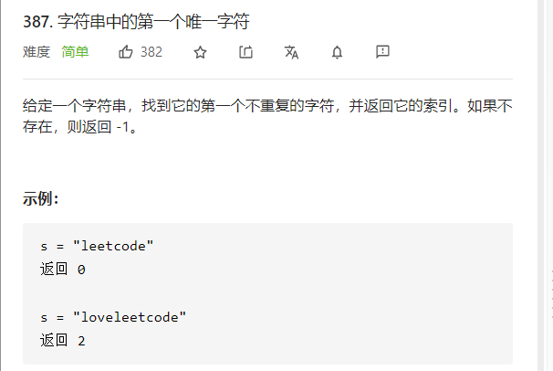

主要学习unordered_map

```c++
int firstUniqChar(string s) {
    map<char, int> m;
    for(char a:s){
        ++m[a];
    }
    for(int i=0;i<s.size();i++){
        if(m[s[i]]==1)
        return i;
    }
    return -1;
}
```


